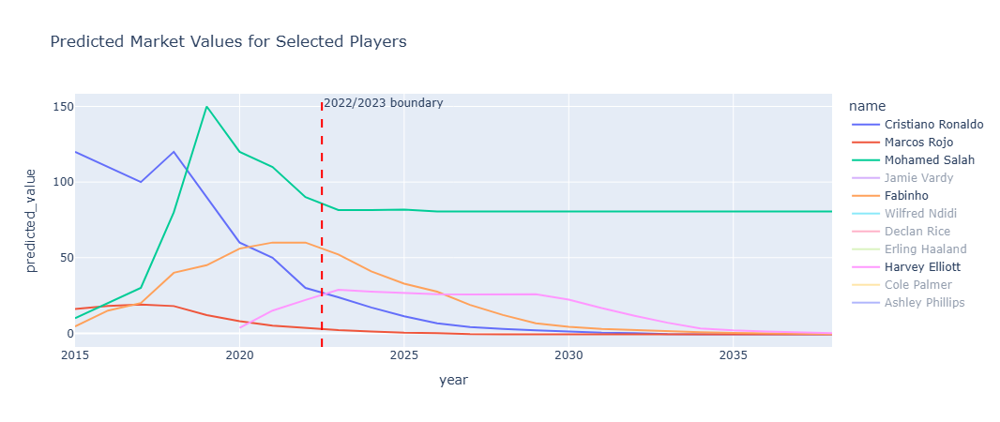
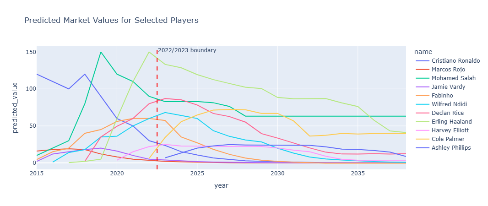

In football players real life value predictions we'd expect them to decrease over time where when you're 40 you should be close to 0.

What has actually be seen in versions up to 0.0.5 was values to platou.

This was because when players retired the were removed from the data.

Synthetic data was added for version 0.0.6

This had improved results, but for the high value players it didn't

For all apart from the high value players like Salah and people Haaland it worked well.

The sythentic data caused improvements, but not complete ones

There aren't high value players in the synthetic data.

The highest value was 22.5M - this means the model won't learn the lessons.

Especially when ("year <2023") it's 4.5 

Synethic data was added which was hard coded which improved this in some ways for example Salah but not for Haaland.

More was added, to take it to 18 records but this didn't improve it particularly
