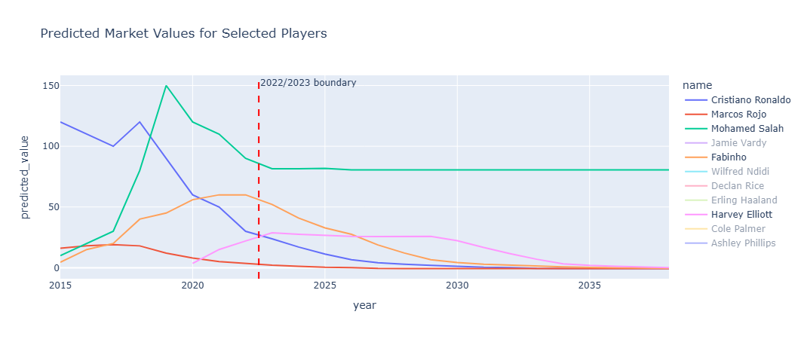
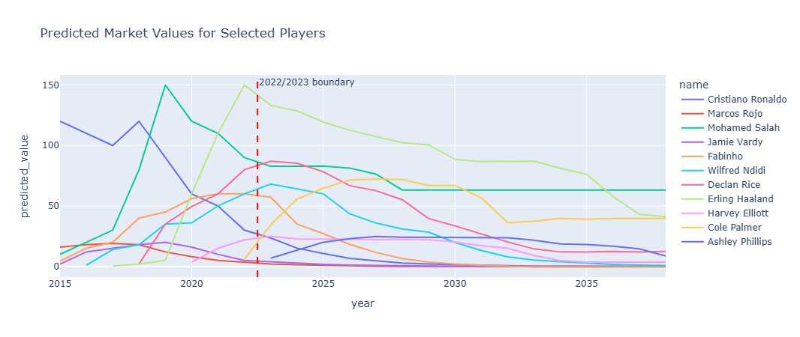

# Improving Late-Career Value Predictions with Synthetic Data

## The Problem: Unrealistic Value Plateaus

In real-life football, we expect player market values to decrease significantly with age—by the time a player is 40, their value should be close to zero.

However, in versions up to **0.0.5**, we observed that predicted values tended to plateau rather than decline. This issue arose because retired players were removed from the dataset, so the model never learned the natural decline that occurs late in a player's career.

## Introducing Synthetic Data (v0.0.6)

To address this, **synthetic data** was introduced in version **0.0.6**. This addition improved results for most players, but high-value players like Salah and Haaland were still not well modeled. The synthetic data did not include enough high-value examples—the highest value in the synthetic set was only **22.5M**, which limited the model's ability to learn appropriate decline patterns for top players. For context, before 2023, the highest synthetic value was just **4.5M**.

## Limitations for Elite Players

While the synthetic data helped for most players, it was not sufficient for the elite group. Additional synthetic records were added, bringing the total to 18, but this still did not fully resolve the issue.

## Manual Capping (v0.0.8)

Ultimately, in version **0.0.8**, a manual cap was introduced for players over the age of 32 to enforce a more realistic decline in value.

## Summary and Next Steps

- **Synthetic data** is effective for modeling typical player value decline, but not enough for elite/high-value players unless the synthetic set covers their value range.
- **Manual capping** provides a practical solution for enforcing realistic late-career value drops, but is a workaround rather than a true model improvement.
- **Future improvements** could include generating more representative synthetic data for top players, or exploring models that explicitly account for career stage and retirement probability.

This iterative process highlights the importance of both data coverage and domain knowledge in building robust predictive models for football player valuations.