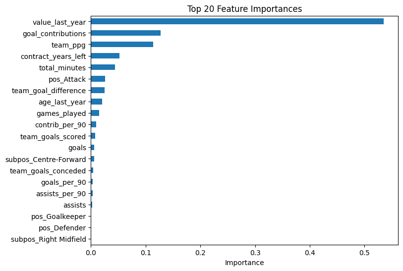
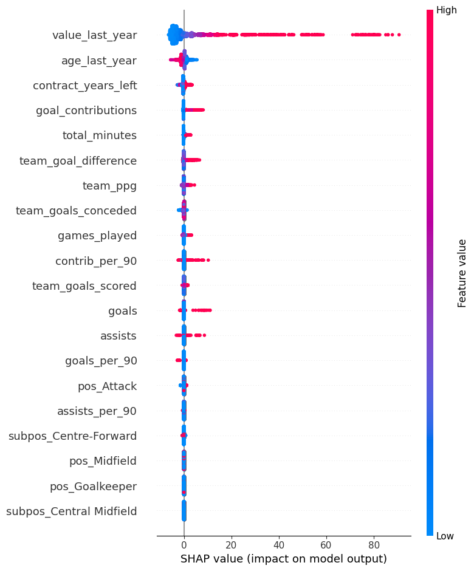

# XGBoost Model POC — Version 0.0.10

**Forecast ID:** `9172dbf0-e716-4d4b-b097-239cbe425fca`

---

## Overview

This version uses XGBoost to predict player market values for the next year, with predictions extrapolated for future years. Several enhancements and constraints have been applied to improve realism and robustness.

---

## Configuration

- **Hyperparameter Selection:** Optuna  
- **Synthetic Data for Retired Players:** Enabled  
- **Fake Players:** Disabled  
- **Artificial Age Value Cap:** Enabled (80% of last year's value for players ≥ 32)  
- **Minimum Cap at 0:** Enabled  

---

## Features Used

- value_last_year
- age_last_year
- pos
- subpos
- contract_years_left
- team_ppg
- team_goal_difference
- team_goals_scored
- team_goals_conceded
- games_played
- total_minutes
- goals
- assists
- goal_contributions
- goals_per_90
- assists_per_90
- contrib_per_90

---

## Model Metrics

### Feature Importance

- **value_last_year** is by far the most important feature (importance: 0.5), with higher values strongly increasing the predicted output.
- **goal_contributions**, **team_ppg**, **contract_years_left**, and **total_minutes** have moderate positive impacts.
- **age_last_year** has a small impact, as artificial constraints are used to prevent unrealistically high values at advanced ages.
- The model's focus on single-year changes may limit its ability to capture large value shifts.

---

### Shapley Values

---

## Notes

- The model only predicts one year ahead at a time, then extrapolates for future years.
- RMSE and R² are calculated for the first forecasted year.
- Ensuring sensible long-term value trajectories is prioritized over marginal improvements in short-term